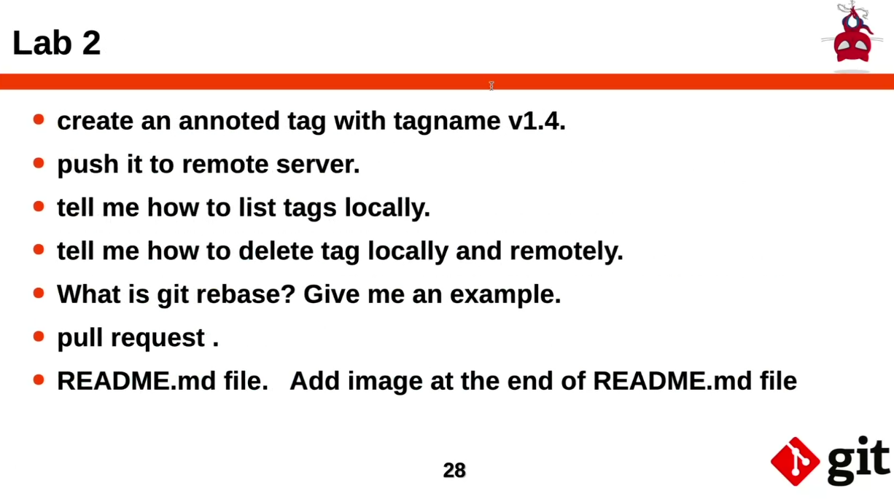

# Lab 2.1
## Create a new repo
```
git init
echo "Initial Commit" > README.md
git add README.md
git commit -m "Initial Commit"
git branch -M main
git remote add origin https://github.com/ShehabFahmy/DevOps_YAT_git_lab2.git
git push -u origin main
```

## Create 2 branches, "dev" and "test", and Modify "dev"
```
git branch "dev"
git branch "test"
git push origin test
git checkout dev
touch file1.txt file2.txt
git add .
git commit -m "Files Added"
git push origin dev
```

## Merge
```
git checkout main
git merge dev
git push origin main
```

## Remove Branches locally and remotely
```
git branch -d dev
git branch -d test
git push origin -d dev
git push origin -d test
```

# Lab 2.2
## Create an annotated tag
```
git tag -a v1.4 -m "Lab 2.1 Completed"
```
## Push it to Remote Server
```
git push origin v1.4
```
or for all tags
```
git push origin --tags
```
## Show tags Locally
```
git tag -l
```
## Delete tag Locally and Remotely
```
git tag -d v1.4
git push -d origin v1.4
```
## What is git rebase
Rebasing is the process of combining a sequence of commits to a new base commit. It allows you to change the base of your branch from one commit to another, which can help in maintaining a linear project history.
Example: rebasing feature branch onto the main branch
```
A---B---C---D (main)	   A---B---C---D (main)
     \			  	        \
      E---F (feature)		         E'---F' (feature)
```
## Pull Request
```
git request-pull v1.4 origin main
```
## Add Image to README.md
```

```
